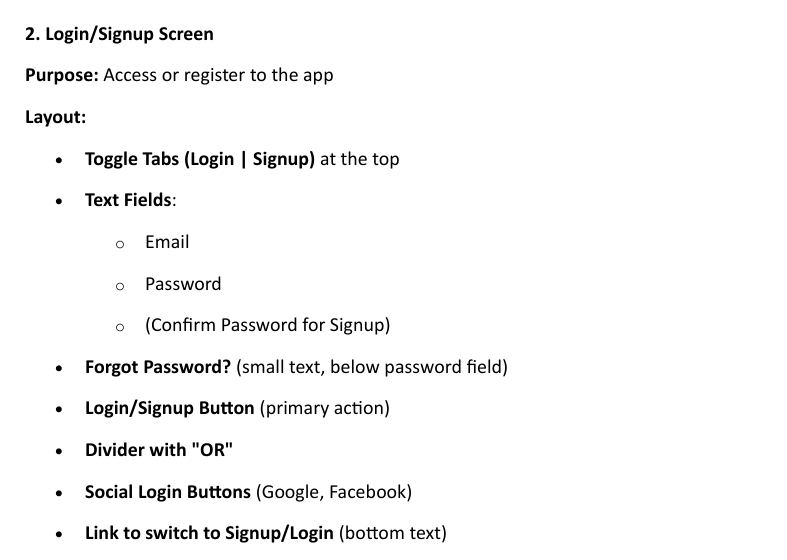

# UI-and-UX-Exp-4

```
Design a wireframe diagram for a generic application or website using Balsamiq, including at least 5 essential screens/pages: Welcome/Splash Screen,

 Login/Signup Screen, Home/Dashboard Screen, Content/Product Listing Screen, and Checkout/Contact/Final Action Screen.

Focus on the layout structure, navigation flow, and placement of UI elements, keeping it simple without using colors or detailed graphics
```





